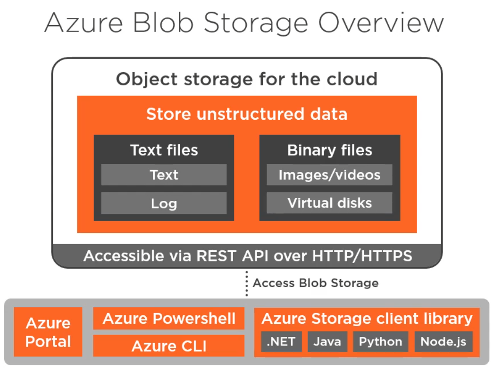
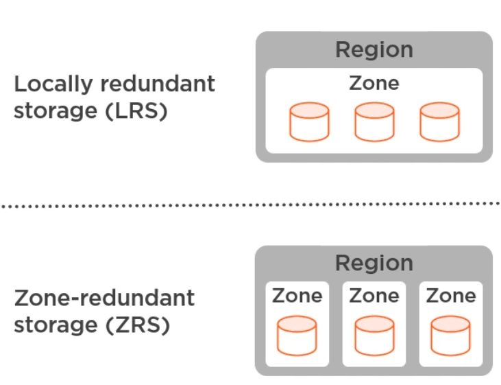
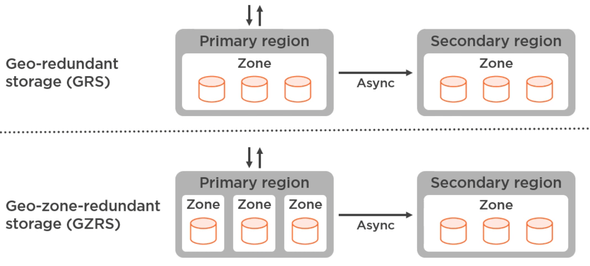

## Blob container
- it has a flat structure, so no directories can be created in the container
- however, when uploading blobs (such as images), virtual folders can be created, by uploading using a "virtual directory"
  in the file name: "cats/my_cat.jpg"

## Authorize requests to Blob storage
- Shared Key (Storage account key)
- Shared Access Signature (SAS) -> generated per blob, each blob having its own SAS
- Azure AD
- Anonymous public access
  - can be set at blob level and container level
  - by granting anonymous access at the container level, the contents of the container can be listed,
    by adding `?comp=list` to its url

## Blob types
- **Block Blob** -> for files such as pictures, movies, pdf, that can not be updated in parts, just replaced
- **Append Blob** -> for example, a log file (errors.log) that needs to be appended. Of course, the file itself 
  is treated as a blob, but can be updated, bot just replaced
- **Page Blob** -> for adding VM disks

## Storage account kinds
- whatever the storage option, data is encrypted at rest
- Storage V2 
  - standard performance (magnetic drives). Supports:
    - **Blob** (Block, Append, Page)
    - **File shares**
    - **Queue**
    - **Table**
  - premium performance (SSD), Supports:
    - **Blob** (Block, Append, Page)
    - **Page Blob** (Page)
    - **File shares**
- Legacy
  - Storage V1 & BlobStorage
  - The legacy option is still supported, for existing accounts 
  - Can upgrade from legacy to V2

## Replication strategy (Redundancy)
- LRS - Locally redundant Storage
  - creates 3 copies of the data in the selected region (westeurope in my examples) 
  - the copies are created in a single availability zone (a data center)
- ZRS - Zone-Redundant Storage
  - recommended for high availability scenarios
  - supported only in those regions that have 3 data centers
  - distributes 3 copies of the data across 3 data centers in the same region (westeurope in my examples)
- GRS - Geo-Redundant Storage
  - recommended for backup scenarios
  - **derived from LRS + secondary region**
  - stores the data in a single data center in a primary region and in a single data center in a secondary region
- GZRS - Geo-Zone-Redundant Storage 
  - **derived from ZRS + secondary region**
  - recommended for critical data scenarios
  - distributes 3 copies of the data across 3 data centers in the same region and in a single data center in a secondary region
For GRS and GZRS we can enable read access to data in the secondary zone, in case of regional unavailability. This 
ensures the creation of a second endpoint for reading the data, from the secondary regions, by adding the
term `-secondary` in the initial storage URL. 
`https://<storageaccountname>-secondary.blob.core.windows.net`

