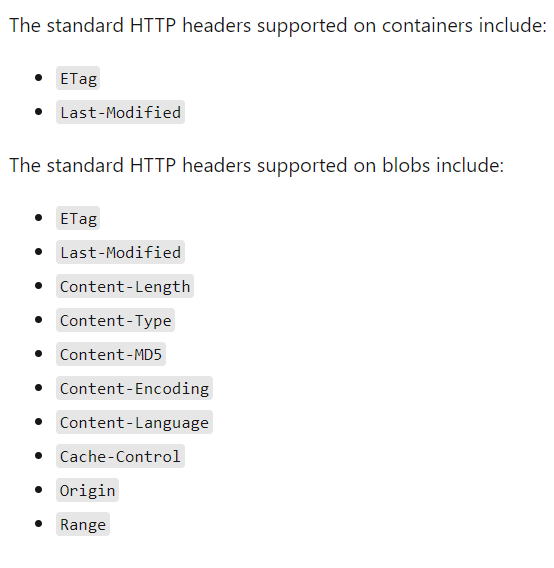
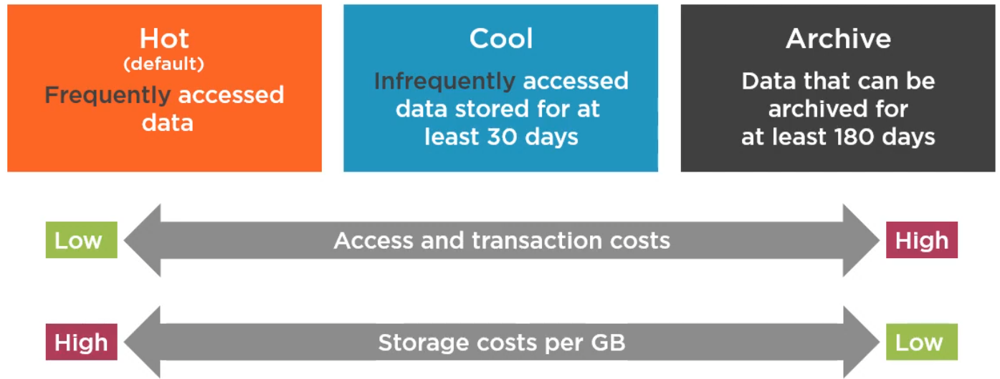
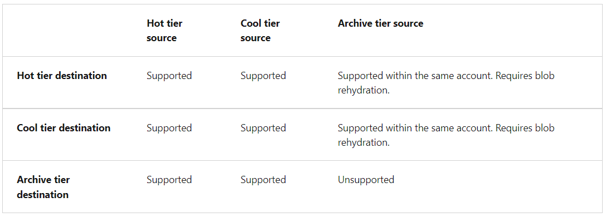
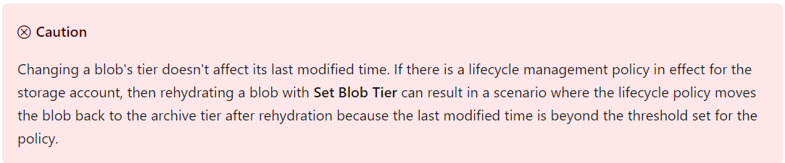
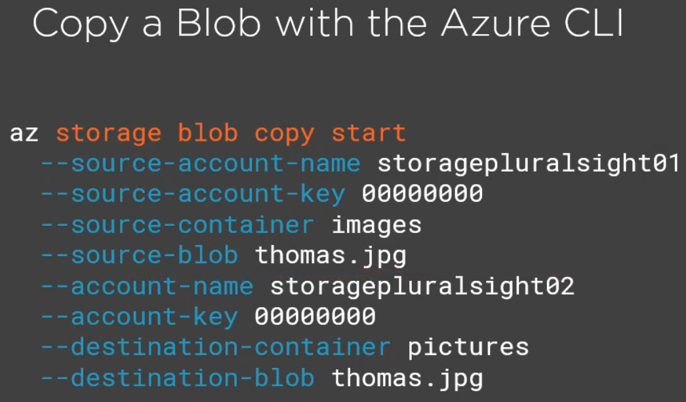
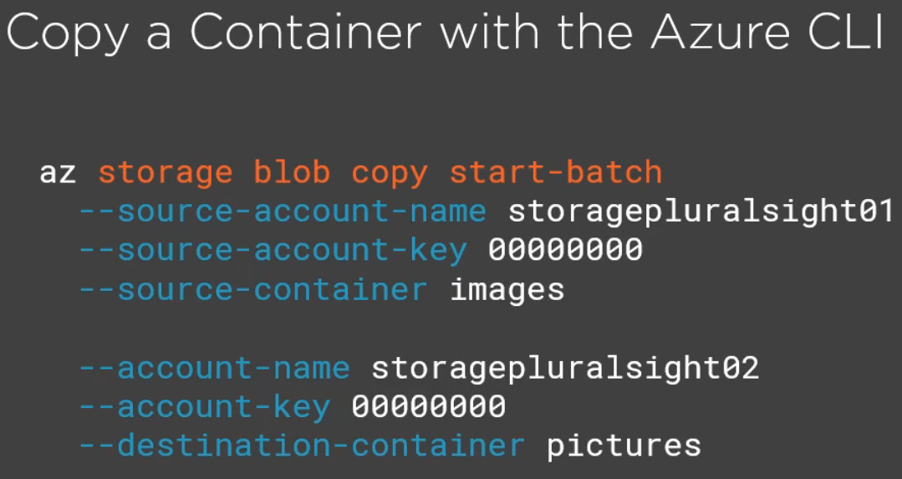

- Objects in Blob storage are accessible via the Azure Storage REST API, Azure PowerShell, Azure CLI, or an Azure Storage client library.
- Blob storage is designed for:
  - Serving images or documents directly to a browser.
  - Storing files for distributed access.
  - Streaming video and audio.
  - Writing to log files.
  - Storing data for backup and restore, disaster recovery, and archiving.
  - Storing data for analysis by an on-premises or Azure-hosted service.

## Security
- Data in Azure Storage is encrypted and decrypted transparently using 256-bit AES encryption, 
  one of the strongest block ciphers available, and is FIPS 140-2 compliant
- Azure Storage encryption is enabled for all new and existing storage accounts and cannot be disabled
- All Azure Storage resources are encrypted, including blobs, disks, files, queues, and tables. All object metadata is also encrypted
- You can rely on Microsoft-managed keys for the encryption of your storage account, or you can manage encryption with your own keys

## Blob container
- it has a flat structure, so no directories can be created in the container
- however, when uploading blobs (such as images), virtual folders can be created, by uploading using a "virtual directory"
  in the file name: "cats/my_cat.jpg"

## Authorize requests to Blob storage
- Shared Key (Storage account key)
- Shared Access Signature (SAS) -> generated per blob, each blob having its own SAS
- Azure AD
- Anonymous public access
  - can be set at blob level and container level
  - by granting anonymous access at the container level, the contents of the container can be listed,
    by adding `?comp=list` to its url

## Blob types
- **Block Blob** -> for files such as pictures, movies, pdf, that can not be updated in parts, just replaced
- **Append Blob** -> for example, a log file (errors.log) that needs to be appended. Of course, the file itself 
  is treated as a blob, but can be updated, bot just replaced
- **Page Blob** -> for adding VM disks

## Storage account kinds
- whatever the storage option, data is encrypted at rest
- Storage V2 
  - standard performance (magnetic drives). Supports:
    - **Blob** (Block, Append, Page)
    - **File shares**
    - **Queue**
    - **Table**
  - premium performance (SSD), Supports:
    - **Block Blob** (Block, Append, Page)
    - **Page Blob** (Page)
    - **File shares**
- Legacy
  - Storage V1 & BlobStorage
  - The legacy option is still supported, for existing accounts 
  - Can upgrade from legacy to V2

## Replication strategy (Redundancy)
- LRS - Locally redundant Storage
  - creates 3 copies of the data in the selected region (westeurope in my examples) 
  - the copies are created in a single availability zone (a data center)
- ZRS - Zone-Redundant Storage
  - recommended for high availability scenarios
  - supported only in those regions that have 3 data centers
  - distributes 3 copies of the data across 3 data centers in the same region (westeurope in my examples)
- GRS - Geo-Redundant Storage
  - recommended for backup scenarios
  - **derived from LRS + secondary region**
  - stores the data in a single data center in a primary region and in a single data center in a secondary region
- GZRS - Geo-Zone-Redundant Storage 
  - **derived from ZRS + secondary region**
  - recommended for critical data scenarios
  - distributes 3 copies of the data across 3 data centers in the same region and in a single data center in a secondary region
For GRS and GZRS we can enable read access to data in the secondary zone, in case of regional unavailability. This 
ensures the creation of a second endpoint for reading the data, from the secondary regions, by adding the
term `-secondary` in the initial storage URL. 
`https://<storageaccountname>-secondary.blob.core.windows.net`

## Properties and Metadata
- exist both on Containers and Blobs
- System properties:
  - Container: ETag, LastModified
  - Blob: ETag, LastModified, Content-Type, Content-Length, x-ms-blob-type
- USer-defined metadata
  - Container & Blob: String-based key-value pairs

 

## Data archiving and Retention
### Access tiers
- Hot - > Default (frequently accessed data)
- Cool -> infrequently accessed data stored for at least 30 days
- Archive -> data that can be archived for at least 180 days

- the access tier is set at the **account level** (only **Hot** and **Cool**), and it is then inferred/inherited at blob level
- it can also be set at **blob level** (**Hot**, **Cool** and **Archive**) 
- once the blob has been moved to the **Archived** access tier, it can't be accessed online anymore. In order to access
  it again, it has to be moved to **Hot** or **Cool**. This process is called **Rehydrating** and it can take 
  up to several hours
- There are two options for rehydrating a blob that is stored in the archive tier:
  - Copy an archived blob to an online tier: You can rehydrate an archived blob by copying it to a new blob in the hot 
    or cool tier with the Copy Blob or Copy Blob from URL operation. Microsoft recommends this option for most scenarios
  - Change a blob's access tier to an online tier: You can rehydrate an archived blob to hot or cool by changing its 
    tier using the Set Blob Tier operation.
- When you rehydrate a blob, you can set the priority for the rehydration operation via the optional x-ms-rehydrate-priority 
  header on a Set Blob Tier or Copy Blob/Copy Blob From URL operation. Rehydration priority options include:
  - Standard priority: The rehydration request will be processed in the order it was received and may take up to 15 hours
  - High priority: The rehydration request will be prioritized over standard priority requests and may complete in under one hour
    for objects under 10 GB in size
- When you copy an archived blob to a new blob an online tier, the source blob remains unmodified in the archive tier. You must
  copy the archived blob to a new blob with a different name or to a different container. You cannot overwrite the 
  source blob by copying to the same blob
- Copying an archived blob to an online destination tier is supported within the same storage account only. You cannot
  copy an archived blob to a destination blob that is also in the archive tier.

## Lifecycle management
- in the Lifecycle management tab, under Data management rules can be set to delete blobs or to move them to the Cool or Archive tiers, 
  if they haven't been accessed in a number of days. Additional filters can be specified (e.g. move only blobs with a specific prefix)
- rules will run once per day and can be enabled/disabled
- different rules can be applied for base blobs, snapshots and versions
- If you define more than one action on the same blob, lifecycle management applies the least expensive action to the blob. 
  For example, action `delete` is cheaper than action `tierToArchive`. Action `tierToArchive` is cheaper than action `tierToCool`.

### Soft deletes
- we have the option to enable soft deletes for both Containers and Blobs
- the blob/container is kept for a specified number of days, after being soft deleted
- after a soft delete, it can be **undeleted**, using the **undelete** option

### Versions and snapshots
- to use versioning, it has to be enabled at account level, in the Data protection tab under the Data management section
- versions can be restored as defaults

### Leases
- leases work like a lock
- we can acquire a lease for a blob
- once the lease has been acquired, the blob cannot be deleted or edited without the lease id

### Immutable blob storage
- on the container level we can add access policies:
  - **Legal Hold** -> the images cannot be modified or deleted as long as there are some tags set on them
  - **Time-based retention** -> the images cannot be modified or deleted for a specified number of days

## Moving items between Storage accounts and Containers
- Azure CLI
- AzCopy (powershell)
- Using a client (Java)

 

## Client library
- the same base classes are in both Java and C#:

| Class               | Description                                                                                                                                                                         |
|:--------------------|:------------------------------------------------------------------------------------------------------------------------------------------------------------------------------------|
| BlobClient          | The BlobClient allows you to manipulate Azure Storage blobs.                                                                                                                        |
| BlobClientOptions   | Provides the client configuration options for connecting to Azure Blob Storage.                                                                                                     |
| BlobContainerClient | The BlobContainerClient allows you to manipulate Azure Storage containers and their blobs.                                                                                          |
| BlobServiceClient   | The BlobServiceClient allows you to manipulate Azure Storage service resources and blob containers.  The storage account provides the top-level namespace for the Blob service. |
| BlobUriBuilder      | The BlobUriBuilder class provides a convenient way to modify the contents of a Uri instance to point to different Azure Storage resources like an account, container, or blob.      |
